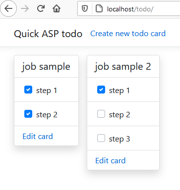

Simple ToDo application on ASP.NET 5.0

Main page contains all 'todo' cards (tasks inside cards can be checked). 

On editing page cards can be created/edited/deleted.

Cards stored in todo.json file in the root of application (don't forget add write permission to directory for IIS user).
